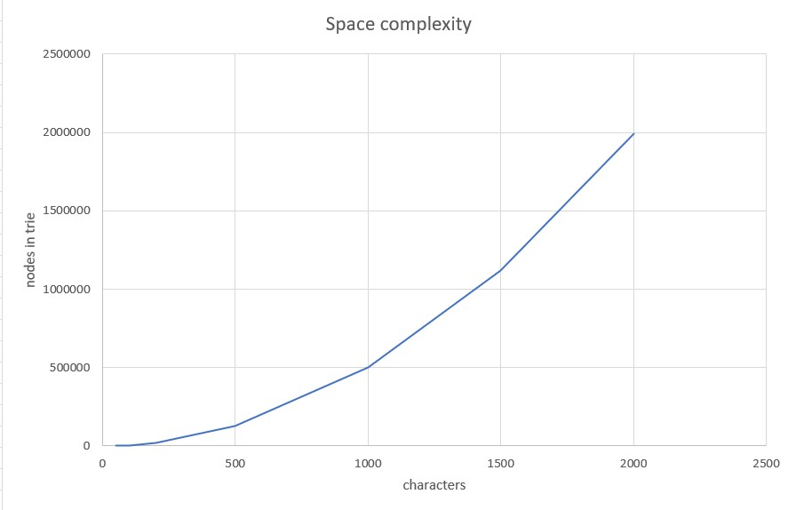

 # Testing document
 
 ## Test coverage report (latest)

## What has been tested and how

The tests can be divided into two categories: 
- complexity tests
- regular tests

### 1. Complexity tests

#### A) TIME

**Insertion**
 - Insertion of 7 strings of test data from NY times API of different length (50, 100, 200, 500, 1000, 1500 and 2000 characters).
 - Comparing time (milliseconds) it takes to insert the strings.

**Search** 

- Search of string *for* from 3 tries of different size (200, 500 and 1000 characters)
- Using library *chrono* in order to measure time of search. 

#### B) SPACE

The measurement of space is amount of nodes. 

- **Linear space:**
Inserting *a* x n where n is 5, 50 and 500. The aim of the test is  to see that the space is growing linearily (output should be 5,50 and 500).

- **Quadratic space:** 
   - Inserting *a*^n *b* ^n , where n is 3, 30 and 300. E.g. *aaabbb* when n is 3. The aim is to see that space is quadratic meaning output should be x, x, and  x. 

- **Exponential/Superlinear space**
    - Test data from NY Times API. Different strings of different length (50, 100, 200, 500, 1000, 1500 and 2000 characters)
    - Insertion of all 7 strings and comparing output in a graph. 

### 2. Regular tests

To be completed

## What types of input were used (especially important for comparative analysis)

## How can the tests be repeated

## Results of empirical testing presented in graphical form
 
 
 

