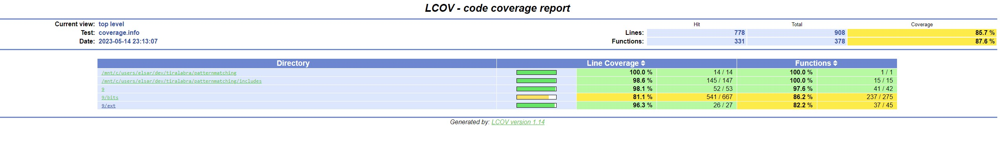
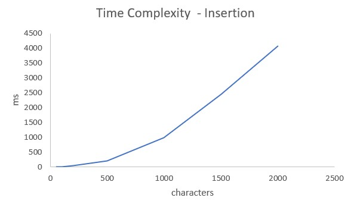
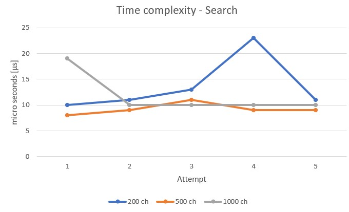
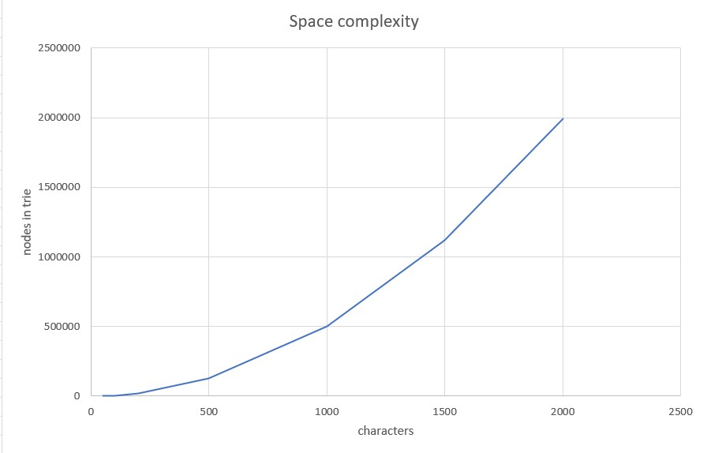

 # Testing document
 
The project has all in all 26 tests in 4 test suites.
 
 ## Test coverage 



<br />
<br />
<br />

## What has been tested and how

The tests can be divided into two categories: 
- complexity tests
- regular tests

<br />
<br />

### 1. Complexity tests

#### A) TIME

**Insertion**
 - Insertion of 7 strings of test data from NY times API of different length (50, 100, 200, 500, 1000, 1500 and 2000 characters).
 - Comparing time (milliseconds) it takes to insert the strings.

**Search** 

- Search of string *for* from 3 tries of different size (200, 500 and 1000 characters)
- Using library *chrono* in order to measure time of search. 
- 5 attempts and illustrating the results per attempt.

<br />
<br />

#### B) SPACE

The measurement of space is amount of nodes. 

- **Linear space:**
Inserting *a* x n where n is 5, 50 and 500. The aim of the test is  to see that the space is growing linearily (output should be 5,50 and 500).

- **Quadratic space:** 
   - Inserting *a*^n *b* ^n , where n is 3, 30 and 300. E.g. *aaabbb* when n is 3. The aim is to see that space is quadratic meaning output should be 9, 900, and 90 000. 

- **Exponential/Superlinear space**
    - Test data from NY Times API. Different strings of different length (50, 100, 200, 500, 1000, 1500 and 2000 characters)
    - Insertion of all 7 strings and comparing output in a graph. 

<br />
<br />
<br />

### 2. Regular tests

- 6 tests for search feature (RSearchTest), 3 which should succeed and 3 which shuld fail.
- 4 tests for autocomplete feature (RAutoCompleteTest), 2 which should succees, 2 which should fail.

<br />
<br />
<br />

## How can the tests be repeated

 The tests can be repeated by going to main folder and compiling & running
 
```bash
cmake CMakeLists.txt
```

```bash
make
```

```bash
./executeTests
```
<br />
<br />
<br />

## Results of empirical testing presented in graphical form

<br />
<br />
<br />


- From the graph above, which illustrates **time complexity of insertion to a trie** we can see that insertion of a string to the trie grows exponentially/superlinearily. 
- While inserting a string of length 50 only takes 2 ms, a string of 2000 characters takes 4070 ms = 4.07 seconds. 
- This is in accordance with the knowledge that regular insertion to a trie (without any special algorithm) takes O(n^2) time. 

<br />



- From the graph above, which illustrates **time complexity of search from a trie** we can see that the results vary on each attempt. The times it takes to search  a string of 3 characters from a trie that consists of a string of 
   - 200 characters: 10 - 23 µs (micro seconds)
   - 500 characters: 8 - 11 µs
   - 1000 characters: 10 - 19 µs
  
  From the results we can conclude that the variations are minimalistic as we speak about microseconds (10^ -6 or 0.000001 seconds). We can conclude that it takes the same amount of time to search a string A of length M meaning O(m), irrespective of the size of the trie. 


<br />



- The space complexity of the trie depends on the number of nodes present in the trie.
- From the graph above, which illustrates **space complexity of insertion to a trie** we can see that the amount of nodes grow superlinearily with the amount of characters in a string. 
- The test string of 50 characters led to 1089 nodes, while the test sting of 2000 characters led to almost 2 000 000 (2 million) nodes. 
- There are 26 unique characters in the english alphabet and adding the terminator character ($) it adds up to 27.
- A trie with N nodes will need O(N*k) space due to the pointers in each node, where k is the total number of unique characters in the alphabet.


